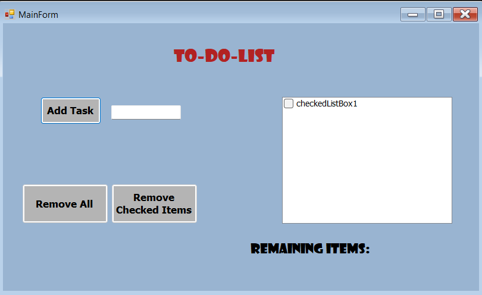

# ✅ To Do List App

A desktop **To Do List** application built using **C# Windows Forms**. This project demonstrates GUI development, event-driven programming, and basic task management through a clean and user-friendly interface.

---

## ✨ Features

- ➕ Add new tasks
- 🗑️ Delete tasks
- ✅ Mark tasks as completed
- 📋 Display tasks in a list
- 🖱️ Simple and easy-to-use interface

---

## 🛠️ Technologies Used

- C#
- Windows Forms (.NET Framework)
- Visual Studio

---

## 🎯 Learning Objectives

This project helped me practice:

- Windows Forms development
- Event-driven programming
- Object-Oriented Programming (OOP)
- Working with ListBox, Buttons, and CheckBoxes
- Managing collections of data
- Writing clean and maintainable C# code

---

## 📸 Screenshot

### 📝 Main Form



---

## 🚀 How to Run

1. Clone the repository:

```bash
git clone https://github.com/moe-stack24x/To-Do-List-App.git
```

2. Open the solution in **Visual Studio**.

3. Build and run the project.

---

## 👨‍💻 Author

**Mohamed Idris**

- GitHub: https://github.com/moe-stack24x
